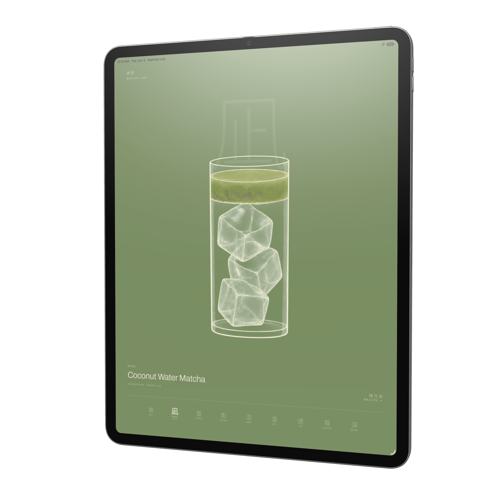
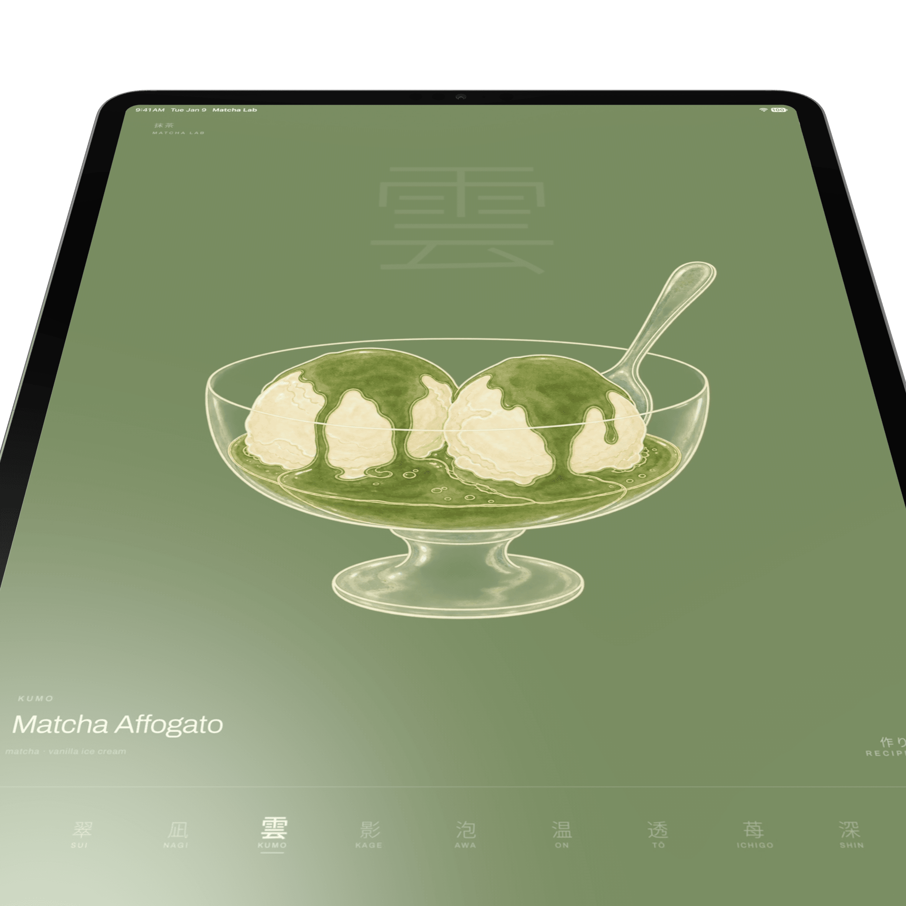
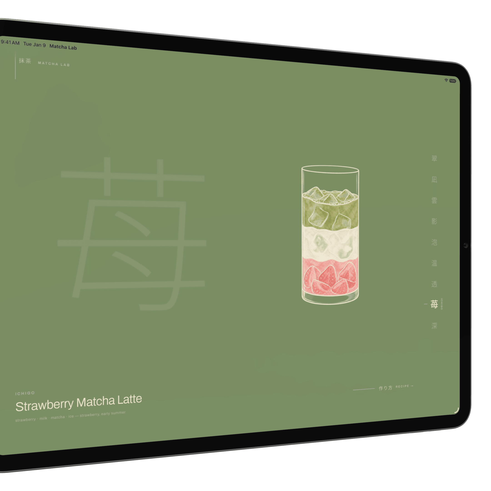
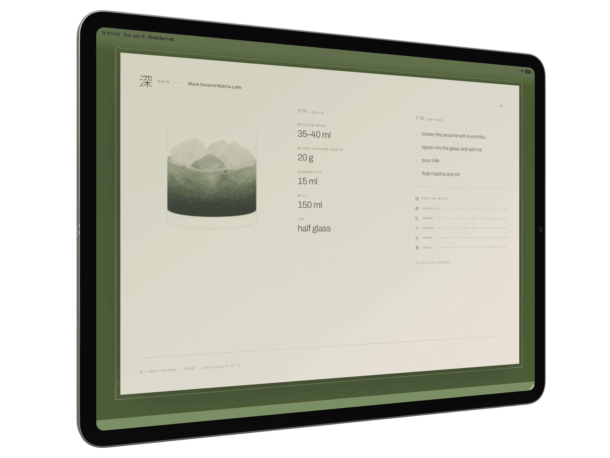

# Matcha Lab

Nine matcha drinks, one at a time, on a flat field of matcha green.

An iPad web app built as one still screen. You swipe between the nine drinks and tap one to see
how it is made — nothing scrolls, nothing stacks, and the only thing that moves is the thing you
touched. It installs to the iPad home screen and opens from a cold cache with no network.

That is the whole app. There is no account, no saving, no list to manage.

## Screenshots

| Drink browser | Drink details |
| --- | --- |
|  |  |
|  |  |

## Video

[](https://youtu.be/b5GbFR62vLA)

## Running it

```bash
bun install
```

```bash
bun --bun run dev
```

Then open <http://localhost:3000>. Designed for iPad — a narrow window is the closest thing on a
desktop.

## Scripts

| Script | Does |
| --- | --- |
| `bun --bun run dev` | Dev server on port 3000 |
| `bun run build` | Production build into `.output/` |
| `bun run preview` | Serve the production build locally |
| `bun run typecheck` | Type check |
| `bun test` | Unit tests |
| `bun run generate-routes` | Refresh the route tree after adding a route |
| `bun run fonts` | Re-subset the fonts — run after adding any Japanese glyph |
| `bun run renders` | Regenerate the nine drink renders |

## Deploying

The build is a plain static site: one directory, `.output/public/`, that any host will serve.

```bash
bun run build
```

Read **[docs/deploy.md](./docs/deploy.md)** before the first deploy. iOS only offers **Add to Home
Screen** over `https`, so nothing about the home-screen experience is verified until the app is on
a real origin.

## Read before changing anything

| Document | For |
| --- | --- |
| [`AGENTS.md`](./AGENTS.md) | Where files go, comment and commit conventions |
| [`DESIGN-TASTE.md`](./DESIGN-TASTE.md) | The design system — every colour, size and timing is a token |
| [`docs/design/layout-geometry.md`](./docs/design/layout-geometry.md) | Every measurement, viewport by viewport |
| [`docs/design/image-generation.md`](./docs/design/image-generation.md) | The contract the nine drink renders were made under |
| [`docs/deploy.md`](./docs/deploy.md) | Hosting, caching, and the on-device install checks |

If you are about to hard-code a colour, a type size or an edge margin, it already exists in
`src/styles.css`.
